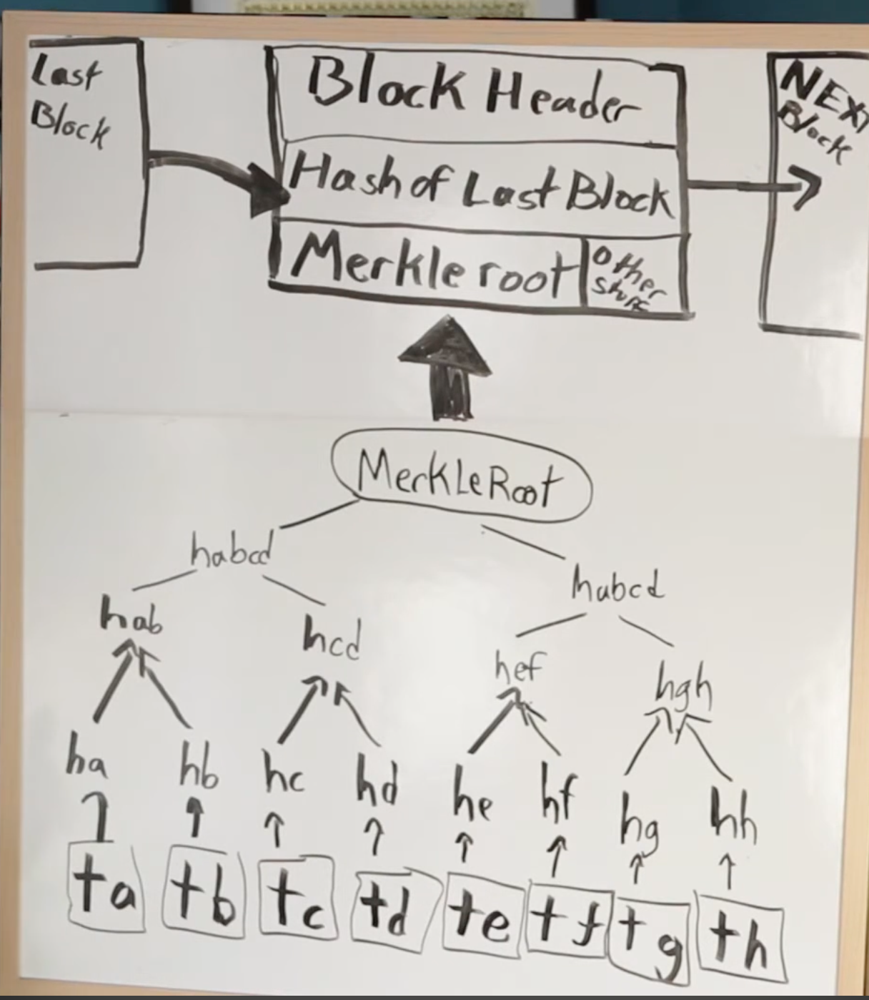

# Muxin

Hello guys, I'm Muxin, I'm learning everything about Ethereum, especially for Ethereum Protocol. I'm good at Web development. Follow me on Twitter: <https://twitter.com/muxin_eth>, my telegram: <https://t.me/muxin_eth>.

## Notes

### 2024.4.12

Week2

refs:

- https://epf.wiki/#/eps/week2
- https://ab9jvcjkej.feishu.cn/docx/BRDdd8kP9o00a2x6F4scRo0fnJh

Block validation:

Consensus Layer:

- [process_execution_playload](https://github.com/ethereum/consensus-specs/blob/dev/specs/deneb/beacon-chain.md#modified-process_execution_payload)
  先进行一系列的校验：verify paret hash 和 previous execution payload header 一致性、pre_randao、timestamp、commitments ≤ limit、execution payload，然后将 versioned_hashes 和 parent_beacon_block_root 传到 execution engine，CL 和 EL 的通信是通过 execution engine 实现的。
- [notify_new_payload](https://github.com/ethereum/consensus-specs/blob/dev/specs/deneb/beacon-chain.md#modified-notify_new_payload)
  将 execution playload 发送到 execution engine，然后 execution client 会执行 state transition function。

### 2024.4.11

缺席

### 2024.4.10

今天时间有限，学习了 Node 和 Client 的内容：

- Node：任何以太坊客户端软件的实例，它连接到其他也运行以太坊软件的计算机，形成一个网络。
- Client：以太坊的实现，它根据协议规则验证数据并保持网络安全。

一个 Node 需要运行两种客户端软件：consensus client 和 execution client。

- consensus client：实现权益证明共识算法，使网络能够根据来自 execution client 的验证数据达成一致。 此外还有名为“验证者”的第三种软件，它们可被添加到 consensus client 中，使节点能参与保护网络安全。
- execution client：侦听网络中广播的新交易，并在 EVM 中执行它们，并保存所有当前以太坊数据的最新状态和数据库。

client 可以使用不同的编程语言开发，但是需要遵循同一套规范。使用不同的编程语言实现 client，能够减少对单一代码库的依赖，避免单点故障，产生多样性，也能拓宽开发者社区。

几个可以追踪当前以太坊网络中节点的情况的网址：

- https://etherscan.io/nodetracker
- https://ethernodes.org/
- https://nodewatch.io/

Node 的类型：

- Full node：全节点对区块链进行逐块验证，包括下载和验证每个块的块体和状态数据。 全节点分多种类别——有些全节点从创世区块开始，验证区块链整个历史中的每一个区块。 另一些全节点则从更近期的区块开始验证，而且它们信任这些区块是有效的（如 Geth 的“快照同步”）。 无论验证从哪里开始，全节点只保留相对较新数据的本地副本（通常是最近的 128 个区块），允许删除比较旧的数据以节省磁盘空间。 旧数据可以在需要时重新生成。
- Archive node：归档节点是从创世块开始验证每个区块的全节点，它们从不删除任何下载的数据。这些数据以太字节为单位，这使得归档节点对普通用户的吸引力较低，但对于区块浏览器、钱包供应商和链分析等服务来说则很方便。
- Light node：轻节点只下载区块头，而不会下载每个区块。 这些区块头包含区块内容的摘要信息。 轻节点会向全节点请求其所需的任何其他信息。 然后，轻节点可以根据区块头中的状态根独自验证收到的数据。 轻节点可以让用户加入以太坊网络，无需运行全节点所需的功能强大的硬件或高带宽。 最终，轻节点也许能在手机和嵌入式设备中运行。 轻节点不参与共识（即它们不能成为矿工/验证者），但可以访问功能和安全保障和全节点相同的以太坊区块链。

### 2024.4.9

今天继续学习图解 EVM 的 PDF：https://takenobu-hs.github.io/downloads/ethereum_evm_illustrated.pdf

- account 是 address 和 account state 对应的一个 mapping。

- account state 包含了 nonce、balance、storage hash(?) 和 EVM code hash(?)。

  - EOA（externally owned account）是由 private key 控制的，它的 account state 不包含 storage 和 EVM code。
  - contract account 是由 EVM code 来控制的，它的 account state 是包含 storage 和 EVM code 的。

- world state 是 account state 的总集合，它记录了所有以太坊的账户信息，每一个以太坊节点中都会有一份相同的 copy。当某些 account state 发生了改变时，world state 也会随之发生改变，所以它是一份不断变化的数据。状态的变化是一个转移的过程，每当有新的交易产生时，就会导致 world state 从 σ𝑡 转移到 σ𝑡+1。

### 2024.4.8

今天学习了一下 EVM

参考资料：

- https://inevitableeth.com/home/ethereum/evm
- https://ethereum.org/en/developers/docs/evm/
- 图解 EVM（推荐！）：https://takenobu-hs.github.io/downloads/ethereum_evm_illustrated.pdf

EVM（Ethereum Virtual Machine）是以太坊的计算平台，是以太坊的核心组成部分，是智能合约的运行时环境，是图灵完备的分布式状态机（以太坊不是像 BTC 一样的分布式账本，除了保存所有账户和余额，它还保存了一个机器状态），是基于栈（stack）的虚拟机。它还提供了一个沙盒环境，保证了智能合约的执行是隔离的，不受外界因素影响，确保了安全性和稳定性。EVM 还内置了加密学函数，包括哈希和数字签名算法，使智能合约能够进行安全的加密操作。

EVM 兼容是指提供了类似 EVM 的代码执行环境，可以方便以太坊开发者将智能合约迁移至兼容链/平台，不用再重新开发一遍。比如：BSC、Polygon、Avalanche、HECO 等。

### 2024.4.7

今天做了一下以太坊官网上的 [quizzes](https://ethereum.org/en/quizzes/)，可以很明显的看出自己哪些内容需要学习，特别是 Using Ethereum 部分，今天就先整理一下错题。

1. 以太坊的共识层在被叫做共识层之前是被称作 Eth2 的，但是在升级之后如果有人拿 Eth2 来表示 Eth 的升级后版本，一般都是诈骗的。
2. 这道题问的是哪个选项是用来扩展以太坊的，Layer2 rollups 捆绑交易、Proto-Danksharding 为这些数据创建廉价的临时存储、Danksharding 共享存储负担，使所有 validator 都能访问。
3. Proto-Danksharding 是如何在 rollups 上降低 rollup transaction 花费的？
   Proto-Danksharding 创建了临时的 ”blob“ 存储，可以让 rollups 更加便宜的将结果发布到主网。

4. 对于 rollups 扩展以太坊的关键的下一步是什么？
   将 sequencers 和 provers 的责任分散到更多人的身上。对 rollup 的控制是从中心化开始的，因为这有助于启动，但也使 network 容易收到审查。将交易过程去中心化处理，使任何人都可以参与其中，对防止网络被妥协的可能性至关重要。

5. 如果你的节点离线了会发生什么？
   当你的节点不在线的时候，它将不能从节点同步接收到新的交易和区块，所以会跟链上的当前状态脱节。重新连接到网络将使你的节点软件重新同步，以便再次完全正常运行。

6. 一个 validator 要获得盈利的正常运行时间是多少？
   答案是大约 50%，处于离线状态的时间如果是 50%，仍然可以实现盈利，但是比那些更加可靠可用的 validator 要少。

7. 如果一个 validator 离线了会发生什么？
   当 validator 不可用时，会产生小额的 inactivity 惩罚，大约等于正确证明所获奖励的 75%。在罕见/极端情况下，如果 network 未完成最终状态（即超过 network 的 1/3 也处于离线状态），这些惩罚将显著增加。当 validator 恢复在线时，奖励会恢复，不会发生惩罚。

8. 运行被大多数其他 validator 使用的 client 会是你在该 client 存在软件错误的情况下面临被 slashed 的风险，而运行少数人使用的 client 可以防止这种情况发生。

### 2024.4.6

今天学习的是 Week 1 的内容

> Week 1 pre-reading 的这部分 https://inevitableeth.com/home/ethereum/world-computer 之前有看过，感觉里面介绍的每一个概念都需要好好深入学习，里面针对每一个概念也都有对应的 Deep Dive 的链接，我是想先尝试学习 protocol 的部分，如果涉及到了不懂的地方再回头补上。

没有看视频，学习内容来源：

- https://epf.wiki/#/eps/week1?id=study-group-week-1-protocol-intro
- https://twitter.com/EIPFun/status/1759938839890522603 感谢 Chloe 的整理

**1. Prehistory and Philosophy**

这里提到了 UNIX，它是一个重新定义了计算范式的操作系统和哲学。这个范式已经使用了 50 多年，从未真正改变过。其模块化的基本概念对以太坊的设计和贝尔实验室的开放协作环境有重要意义。可以看一下这个视频（from Dennis Ritchie and Ken Thompson）：https://yewtu.be/watch?v=tc4ROCJYbm0。

这里还提到了自由软件运动是以太坊和所有加密货币的基础。以太坊的开放、独立和协作开发文化深深植根于 FOSS（Free and Open Source Software），以太坊需要在软件中透明地实现，为用户提供充分的自由。扩展阅读在后面，需要了解一下什么是 free software，以及它的重要性。

非对称密码学的发明标志着密码学应用新范式的诞生。

**2. Ethereum Protocol Design**

目前的协议规范是由 Python 实现的，包括了：Exection specs 和 Consensus specs，并且会在 EIP 社区中进行变更的跟踪。每次网络升级也都会进行协议的更新，但是总会遵循这几个原则：Simplicity, Universality, Modularity, Non-discrimination, Agility。

**3. Implementations and Development**

执行层（EL）和共识层（CL）的实现称为客户端，运行此客户端并连接到网络的计算机称为节点。并且以太坊是允许使用不用语言来实现，经过时间的洗礼，有些也已经废弃了，这里是列表https://ethereum.org/en/developers/docs/nodes-and-clients/#execution-clients。有关 EL 和 CL 会在之后进行详细的学习。

**4. Testing**

由于有定期的变更和多个客户端的实现，测试对于 network 安全来说是非常重要的，根据不同的场景/客户端也会有不同的测试工具。 包括 state transition testing, fuzzing, shadow forks, RPC tests, client unit tests and CI/CD 等。

**5. Coordination**

以太坊不像中心化的公司，它是完全去中心化、公开的组织，任何人都可以参与贡献，每个人都可以参与到以太坊中自己最感兴趣的部分，其中开发的（新的 feature 或 changes）流程是：idea - research - development - testing - adoption，如果大家有问题、idea、以及获取最新的 update，都可以去社区内定期的会议（ACD，可以在 https://github.com/ethereum/pm 查看 schedule 和 notes）、discord（https://discord.com/invite/qGpsxSA）、forum（https://twitter.com/EthMagicians，https://twitter.com/ethresearchbot）等。

里面提到的一些比较感兴趣需要额外学习的文档或书籍（TODO）：

- https://www.deusinmachina.net/p/history-of-unix
- https://yewtu.be/watch?v=Ag1AKIl_2GM
- https://www.gnu.org/philosophy/free-sw.html
- https://ethereum.org/en/whitepaper/#ethereum-whitepaper
- https://ethereum.github.io/yellowpaper/paper.pdf
- https://ethroadmap.com/
- https://archive.devcon.org/archive/
- https://www.camirusso.com/book 这本书看过中文翻译版本，翻译的比较混乱，有时间可以在看一下原版
- https://www.goodreads.com/book/show/55360267-out-of-the-ether
- https://www.routledge.com/Absolute-Essentials-of-Ethereum/Dylan-Ennis/p/book/9781032334189
- https://github.com/ethereumbook/ethereumbook
- 还有一个 Ethereum quiz，明天可以做一下

### 2024.4.5

今天学习了 Week 0 Pre-reading 的部分

**1. Cryptography**

之前没有系统的了解过，所以这次稍微花了点时间

密码学分为古典密码学和现代密码学：

- 古典密码学：主要关注信息的保密书写和传递，以及与其对应的破译方法，比较依赖于设计者和敌手的创造力与技巧，作为一种实用性艺术存在。简单来说加密就是把普通信息转换成难以理解的信息，解密就是相反的过程。比较常用在战争、宗教（加密观点，免遭迫害）、“情书”等。
  - Caesar cipher（凯撒密码）：使用的是替换法，每个字母被往后位移三个字母所替代。
  - Vigenère cipher（维吉尼亚密码）：使用的是多字符加密法，加密重复使用到一个关键词，用哪个字母取代端视轮替到关键字的哪个字母而定。
  - Enigma machine（恩尼格玛密码机）：是德国在第二次世界大战中的重要工具。
- 现代密码学：除了关注信息保密问题外，还涉及信息验证码、数字签名、分布式计算中产生的信息安全问题。
  - symmetric-key encryption（对称密钥加密）：消息被一个密钥 key 加密，消息发送者会把密钥 key 和加密后的消息发送给接收者，只要有密钥 key 就能将对应的加密消息解密。但问题是需要保证密钥 key 的安全性。
  - asymmetric encryption（非对称加密）：有一对加密密钥（公钥-由私钥按着一定规则生成，a large number）和解密密钥（私钥- a large and random number），用加密密钥加密后的消息只能通过解密密钥来解密，所以必须要知道两个密钥才能解密。
  - digital signature（数字签名）：类似于手写签名，使用了公钥加密技术，签名者生成一对密钥（公钥和私钥），私钥用于生成数字签名，公钥用于验证签名的真实性。数字签名具有完整性、认证性和不可否认性。
  - signal protocol（加密通信协议）：由 Signal Messenger 公司开发，被广泛用于各种即时通讯应用中，如 Signal、WhatsApp 和 Facebook Messenger。它提供了端到端加密，确保消息只能被发送方和接收方阅读，不会被中间人窃取和篡改。

Hashing：
Hash 是将任意长度的输入数据通过哈希函数转换成固定长度的输出数据的过程，对于不同的输入数据，哈希函数应该生成不同的哈希值，即使输入数据变化很小，生成的哈希值也会有大幅度变化，且哈希函数是单向的，你无法通过哈希值还原出原始输入数据。

**2. Merkle tree in Bitcoin**

在区块链中，每一个区块头部都包含了一个称为 Merkle 根的哈希值，它是由区块中所有交易数据构建的 Merkle 树的根节点的哈希值。在形成一个新的区块时，交易数据会被组织成 Merkle 树。首先，对每个交易数据进行单独的哈希运算得到叶子节点。然后，依次将相邻的叶子节点两两配对，并计算它们的哈希值。如此反复，直到只剩下一个根节点，即 Merkle 根。

当其他节点接收到新的区块时，它们可以通过比对区块头部中的 Merkle 根与交易数据中的哈希值来验证交易数据的完整性。只需获取到少量的数据和 Merkle 树的根节点，节点即可通过递归地比对哈希值验证整个区块中的交易数据是否被篡改。它只需要通过比对树的根节点来验证整个区块中的交易数据，而不需要获取整个区块的数据，所以提升了验证交易数据的高效性。

**3. P2P network**

点对点的分布式网络，没有中心化服务器，每个节点都是对等的，可以互相通信、交换资源和共享信息。在以太坊中主要应用在：区块传播、交易传播、状态同步、共识算法、发现节点等。

**4. Bittorrent**

一种用于文件共享的协议，它是一个基于 P2P network 的协议，旨在实现高效的大规模文件分发。简单来说，它使用分布式的方式进行文件传输，文件被划分成小块，这些小块由不同的节点共享和下载，提高了下载效率。

（文件的共享者会创建一个种子文件（.torrent ），它包含了文件的元数据信息、哈希值以及 tracker 地址等，每个节点都通过下载种子文件来获取文件的信息。Tracker 是一个服务器，用于协调各个节点之间的连接和数据传输。当用户想要下载某个文件时，他们的 Bittorrent 客户端会向 Tracker 发送请求，获取其他拥有相同文件的节点的信息。）
