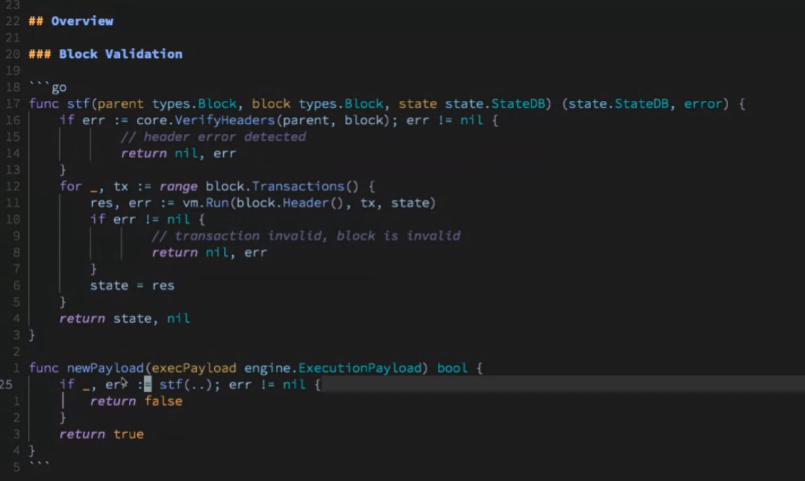

# StephenKuo

Hi, I'm Stephen, a c/c++ engineer, hoping to keep up

## Notes

### 2024.4.5
只有一点点基础，慢慢来希望能把整个协议搞懂
#### Week0 pre-reading
##### Cryptography
- Hashing
  哈希算法，就是哈希表用到的算法，数字分析，取随机数，直接取址什么的。不同的输入可以得到不同的输出，结果不可逆，算法越复杂发生碰撞的概率就越小。
- Public key cryptography
  也叫asymmetric cryptography非对称
  需要公钥和私钥，公钥用来加密，私钥用来解密，也可以用来签名
  
#####  merkle tree
- merkle tree
  用哈希值搭建起来的二叉树，每个节点都是哈希值
  - 叶节点 对于每个区块，每一笔交易数据，进行哈希运算，就是叶节点
  - 中间节点 子节点两两匹配，形成新的字符，再进行哈希运算
  - 根节点 
- 作用
  - 快速比较大量数据
  - 快速定位修改
  - 零知识证明
  
  如何向他人证明拥有某个数据 D0 而不暴露其它信息。挑战者提供随机数据 D1，D2 和 D3，或由证明人生成（需要加入特定信息避免被人复用证明过程）。
  证明人构造如图所示的默克尔树，公布 N1，N5，Root。验证者自行计算 Root 值，验证是否跟提供值一致，即可很容易检测 D0 存在。整个过程中验证者无法获知与 D0 相关的额外信息。
##### Networking, p2p and distributed systems
  - p2p:个人先从服务器上下载一部分文件，然后开始从其他用户(peer)那里下载其他片段。
  - 分布式系统是由一组通过网络进行通信、为了完成共同的任务而协调工作的计算机节点组成的系统。参考https://www.cnblogs.com/xybaby/p/7787034.html
##### Software development basics
solidity 和 solc 编译器

#### Week1 notes
参考了Chloe的笔记，感谢🙏
- The prehistory and philosophy behind Ethereum
  - Unix系统，定义了计算范式，模块化，开源化，协作化
  - Foss运动，软件的四项基本自由，运行自由，学习自由，重新分发自由，修改自由
  - 非对称加密
  - Cypherpunks，建立开放分布系统，不会被政府破坏
- What is Ethereum?
  - Definition & Specs
    whitepaper定义为s "A Next-Generation Smart Contract and Decentralized Application Platform"，下一代智能合约和去中心化应用平台。Yellowpaper定义为"A Secure Decentralized Generalized Transaction Ledger"， 安全的去中心化通用交易账本
- Ethereum is constantly changing
  - 通过EIP(Ethereum Improvement Proposa)进行更改,通过社区而不是个人或entity
  - 多次分叉
- Ethereum的设计原则
  Simplicity, Universality, Modularity, Non-discrimination, Agility, Sandwich/ Encapsulated complexity, Freedom, Neutrality, Generalization, No features, and Non-risk aversion

东西好多明天再学😭

### 2024.4.6
#### Week1 notes-1
##### The Design Itself
- 执行层 执行交易、处理交易数据、账户状态
  1. EVM (Ethereum Virtual Machine): 以太坊的计算平台，提供标准化环境，不同客户端的每次执行都发生在同一环境中
  2. State (data) & Transactions：以太坊是状态机，根据新交易和状态转换函数改变状态，用Merkle Patricia Trie存储
  3. P2P层：执行客户端之间的通信，实现交易传播
  - JSON-RPC API:执行层API, which is connected to user or web3 Dapps like Uniswap etc.
  
- Engine API:执行层和共识层之间的通信，执行层与共识层通信以同步到当前的规范块
- 共识层 共识逻辑、Fork choice、区块传播
  1. Fork choice：Fork choice算法决定链的头部和当前的规范区块
  2. LMD GHOST (Latest Message Driven - Greedy Heaviest Observed SubTree): Fork choice 由 LMD GHOST 管理，规则选择具有最大累计权重（确认次数）的分叉
  3. P2P：共识客户端之间的通信，可以实现区块传播
  4. Blob：EIP-4844 提出的新数据结构
  5. RANDAO：信标链的随机性
- Beacon API： 共识层的API，主要与validators连接。validator 连接到共识客户端以了解其状态，提供证明
  
### POS & POW
Proof of Work（POW）和Proof of Stake（POS）是两种常见的共识算法，用于验证和确认区块链网络中的交易，并决定谁有权创建新的区块。
- 工作原理：
  - POW：矿工需要通过解决复杂的数学问题（例如哈希函数的计算）来竞争创建新的区块。解决问题所需的计算工作量称为”工作证明”，获得工作证明的矿工将获得创建新区块的权利和奖励。也就是挖矿
  -  POS：参与者根据自身持有的数字货币数量（即权益）来决定谁有权创建新的区块。拥有更多权益的参与者将更有可能被选择为区块的创建者。
- 能源消耗
  -  POW：计算量大，消耗大
  -  POS：计算量小，消耗小
- 安全性
  -  POW：由于矿工需要投入大量的计算资源，攻击者要想攻击网络需要掌握超过50%的网络算力，使得攻击成本非常高。因此，POW算法在安全性方面具有较高的保障
  -  POS：在POS算法中，攻击者需要掌握网络上货币的大部分数量，才能对网络进行攻击。这使得POS相对于POW来说，安全性较弱。
- 去中心化程度
  -  POW：POW算法允许任何人参与挖矿，从而实现了网络的分散化和去中心化。矿工可以通过竞争来创建新的区块，而不依赖于特定的权益。
  -  POS：POS算法中，创建新区块的权益是基于参与者所持有的货币数量，这可能导致权益更多的参与者具有更大的影响力。因此，相对于POW来说，POS可能在一定程度上缺乏完全的去中心化。
### 4.7
#### Week2 notes
再次感谢Chloe🙏，令人敬佩
##### 区块验证 Block validation
  共识层 Consensus Layer
  可以从共识层规范中了解共识层如何理解执行层
- Function process_execution_payload：
  - 由beacon chain验证这一个block是否有效，将CL向前移动
  - CL执行一些检查(incl. parent hash, previous randao, timestamp, max blobs per block, etc.)，把payload发送到EL进行更深入的验证
  - CL和EL之间的交流通过执行引擎
  - Spec link: https://github.com/ethereum/consensus-specs/blob/dev/specs/deneb/beacon-chain.md#modified-process_execution_payload
- Function notify_new_payload函数
  - CL 没有实现，因为它只是将执行负载发送到执行引擎，然后执行客户端将执行状态转换功能。
  - Spec link: https://github.com/ethereum/consensus-specs/blob/dev/specs/deneb/beacon-chain.md#modified-notify_new_payload
  
### 4.8
#### Week2 notes
接上文
  Excution layer (EL): Simple illustration written in Go

状态转换函数 State transition function (STF)
- 所需参数
  - Parent block:(需要验证从父块到当前块的转换逻辑)
  - Current block
  - StateDB:(最后一个已知的有效状态，它存储与父块相关的所有状态数据)
- 返回结果
  - 更新状态数据库(StateDB):包括当前block的信息
  - Error(函数失败，状态数据库未更新)
- step 1：验证headers
  - 可能导致error
    - Gas limit 变化超过前一个block的 1/1024
    - block编号不连续
    - EIP-1559 基本费用未正确更新
    - etc.
- Step 2: Apply the Tx if the headers are correct
  - 范围覆盖block tx，通过 VM 执行每个 tx，如果 tx 正确则更新状态
  - 可能导致error
    - 有一个无效的tx，则整个block无效，并且状态不会更新
- Wrap function eg. newPayload
  - 需要的参数 
    - 执行负载（Execution payload）
  - 返回的结果
    - Return bool to the beacon chain
    - beacon chain 再call STF
- Q&A
- Why put block.header() into the vm.Run?
  - There are 2 pieces of context needed when executing the tx
    - The state: eg. Contract code, storage within the account etc.
    - The block context: eg. Parent hash, previous randao, base fee etc.
- The STF is called by the CL and gets returned whether it's valid. If it's not valid, what happens to CL?
  - The block is gonna be rejected.
##### Block building
illustration written in Go
###4.9
###### Build Function

- 所需参数
  - 环境：时间戳、区块号、当前块、base fee
  - Tx pool：维护交易列表，按其价值排序​
  - 状态数据库
- 返回结果
  - block
  - 更新过的状态数据库
  - error
- step 1：跟踪使用过的 Gas 并存储发送到该块的交易
  - 交易可以连续添加到区块中，直到达到gasUse限制。目前主网gas限制大概是30m
- step 2；从交易池中获取下一个最佳交易并执行
  - 用 Pop() 获取下一个最佳交易，通过 VM 执行，并附加所有已执行的交易
  - 如果由于交易无效而出现错误，则该过程将继续，直到没有 Gas 或交易池为空。​
- step 3:使用Finalize函数返回结果
  - Finalize 函数获取交易和有关该块的信息，并生成一个完全组装的块
##### Q&A
- Is the txpool ordered in any way? If not, how do we ensure maximal profit when using pool.Pop?
  - Orderd by the highest paying tx to the builder
  - Every time you call Pop(), you will get the tx that is giving you the most value per gas.
- When building the block, does the EL reject any tx before sending it to the CL?
  - The only time you reject a tx is when it's invalid. In general, the tx pool would verify if the tx is valid, so this situation doesn't occur too much. 
- Encrypted mempools: 1. How viable is that? 2. Since block txs are ordered by gas price, is gas unencrypted under such design?
  - It's a challenging problem and there are many ideas on how to do it. Some might have unencrypted gas, some even have unencrypted sender info, but that all leaks some kind of info. 
  - From Ethereum perspective, this might be solved in the future when an efficient way to encrypt mempool is figured out.
- Whether there are any erase conditions to worry about here? eg. Tx from the mempool being incl. In the block and then be deleted before you build another block
  - The tx pool is supposed to do the tx verification, so generally the txs are valid here. But the pool is not always in sync and might cause some tx to be invalid, and the erase condition could happen. 

##### 进一步深入了解STF、EVM 和 P2P 协议
###### 状态转换函数
- newPayload函数
  TODO